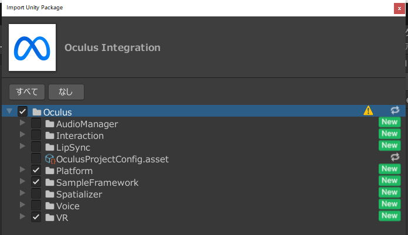

# quest-mr-template
Meta QuestでMRアプリを作るためのUnityのテンプレートプロジェクトです。

# Unityバージョン
2022.3.2f1(起動時に任意のバージョンに変更可)

# 機能
- 頭とコントローラー/手のトラッキング
- 視界全体のパススルー表示
- ルーム設定に基づくオクルージョン
  - 家具
  - 壁、床、天井
  - 深度センサーによってスキャンされたメッシュ
    - Quest 3のみ(2023-10-16現在)
- 現実にCGの影を落とす
- コントローラーのトリガーを押すと玉と豆腐を発射する
  - おまけ機能

# 使い方
1. 緑の「Use this template」ボタンからリポジトリを作成する
2. 作成されたリポジトリをローカルにcloneする
3. Unity Hubにプロジェクトを登録する
4. プロジェクトを開く
    - 任意のUnityバージョンに変更してもOK
    - プロジェクトを開いたらコンソールに「'OVRInput' could not be found」エラーが出るがこのあとの手順で消えるため無視でOK
5. ビルド対象プラットフォームをAndroidに変更する
6. 任意の方法でOculus Integrationをインポートする
    - [Asset Store](https://assetstore.unity.com/packages/tools/integration/oculus-integration-82022)が簡単なのでおすすめ
    - OculusProjectConfig.assetを上書きしないように注意
      - 上書きした場合はgit revertで元に戻す
      - 正しく設定されているかは後の手順で確認できる
    - 全てのファイルをインポートすると時間が掛かるので一部のみでOK
      - Platformディレクトリ
      - SampleFrameworkディレクトリ
      - VRディレクトリ
    - 

7. Oculus/OculusProjectConfig.assetの設定が適切であることを確認する
    - [ ] 「Quest 3」にチェックが入っている
    - [ ] Hand Tracking Supportが「Controllers And Hands」になっている
    - [ ] Scene Supportが「必須」になっている
    - [ ] Passthrough Supportが「必須」になっている
    - 
8. Project Settings > XR Plugin Managementの設定が適切であることを確認する
    - [ ] PC環境で「Oculus」にチェックが入っている
      - Quest Link + Unity Editorで動作確認する場合ために必要
    - [ ] Android環境で「Oculus」にチェックが入っている
      - Quest単体で動かすために必要 
9. Project Settings > XR Plugin Management > Oculus内の「Quest 3」にチェックが入っていることを確認する
10. App/Scenes/MrScene.unityを開く
11. 色々追加していく

# 使用しているライブラリ
- [unity-reference-viewer](https://github.com/ina-amagami/unity-reference-viewer/blob/master/LICENSE.txt)
  - 開発が便利になる
  - 必須ではないので消してもOK
